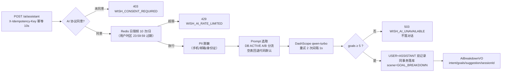
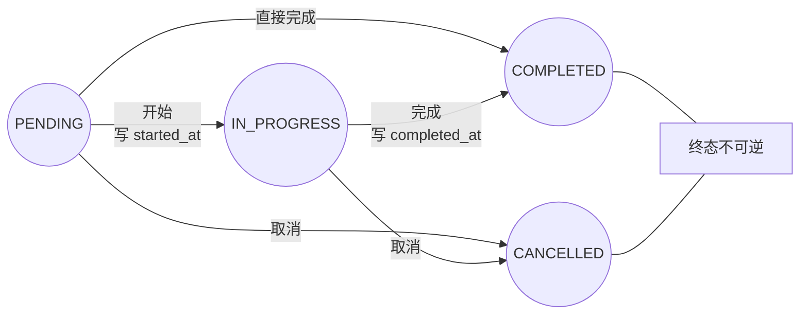

# AI 心愿助手设计文档（Sprint 2.5：表㊱b/㊲c/⑰ + 提醒/报告/Prompt 管理）

> 模块：mall-wish / mall-job / mall-notification / mall-admin · 交付日期：2026-08-24
> 需求依据：心愿宇宙文档 二-2.5 AI 心愿助手 / 2.11 API / 3.1 预期管理 / 9.2 定时任务 /
> 30 章 AI 能力配置 / 32.3-32.4 限频与降级
> 范围：意图分析 + 目标拆解 + 陪伴提醒 + 年度报告 + 预期管理 + Prompt 版本管理 +
> 提醒策略配置；四端前端页面属 s25-8~s25-11，本文档只定义后端契约与策略。

---

## 1. 能力矩阵（含边界与降级）

| 能力 | 能做什么 | 不能做什么 | DashScope 不可用时兜底 |
|---|---|---|---|
| 意图分析+目标拆解 | 识别意图/起始-目标状态，生成 5-10 个可勾选步骤（标题/描述/天数/优先级） | 不提供医疗诊断、药物建议、危险行为指导；步骤数 <5 视为输出不可用（503 不返回） | **无兜底**：503 `WISH_AI_UNAVAILABLE`，提示用户稍后再试（拆解是核心价值，模板拆解无意义） |
| 预期管理引导 | 到期心愿个性化引导文案（30-60 字，提及心愿+鼓励+引导问句），通知含 3 选项按钮 | 未同意 AI 协议用户的心愿内容不外发 DashScope（合规） | 模板降级文案（通知必达，文案是增强） |
| 陪伴提醒 | 用户本地 09 点段推送鼓励文案（5 套模板按年内天数轮换） | 不调 DashScope（低频运营触达，频次/成本可控且必达；个性化由预期管理承担） | 天然免疫（不依赖 AI） |
| 年度报告 growthSummary | 基于全年聚合数据生成 150-250 字成长叙事（异步，稍后重查返回 AI 版） | 不含其他用户隐私（仅本人数据）；无数据年份不调 AI（模板已表达"启程"） | 模板降级文案（报告必达：统计即时返回 + growthSummary 模板版） |
| Prompt/策略管理 | 模板版本管理 + A/B 分流 + 提醒策略热更新（不改代码不重部署） | 模板正文不可变（修改须建新版本，保证可审计可回滚） | DB 空 ACTIVE 模板回退代码默认值（Nacos `wish.ai.*SystemPrompt`） |

合规前置：所有调 DashScope 的能力（拆解/预期引导/报告叙事）先校验
`wish_consent`（AI_DATA_PROCESSING 最新记录 GRANT），未同意返回 403
`WISH_CONSENT_REQUIRED`；未同意用户在通知/报告链路自动走模板降级（通知必达）。

## 2. 目标拆解链路（POST /wish/ai/assistant）



- 步骤数钳制 `[goalMinCount=5, goalMaxCount=10]`；estimatedDays 钳制 1-365、
  priority 钳制 1-5（GoalBreakdownParser，JSON 解析失败降级纯文本再判空）
- 会话 ID：`goal-{userId}-{millis}`，一次拆解一个会话；ASSISTANT 记录存
  拆解结果文本（意图+步骤+建议），供会话回放与数据回收
- Sentinel 资源：`WISH_AI_ASSISTANT_BREAKDOWN`（全部 /ai/* 端点均有注解）

## 3. 拆解步骤状态机（wish_ai_goal，全部 CAS 单条 UPDATE）



| 场景 | 机制 | 错误码 |
|---|---|---|
| 并发双写 | `UPDATE ... SET status=? WHERE id=? AND status=<读取值>`，败方 409 刷新重试 | 409 `WISH_AI_GOAL_STATUS_INVALID` |
| 终态再变更 | 状态机校验拒绝（COMPLETED/CANCELLED → 任意） | 409 `WISH_AI_GOAL_STATUS_INVALID` |
| 非本人/不存在 | 统一 404 防存在性探测（对齐胶囊策略） | 404 `WISH_AI_GOAL_NOT_FOUND` |
| PENDING→PENDING 等非法迁移 | 状态机白名单校验 | 409 `WISH_AI_GOAL_STATUS_INVALID` |

勾选持久化（POST /ai/goals）：批量插入 status=PENDING，关联 sessionId；
列表（GET /ai/goals）：id 倒序游标分页（默认 20 上限 50），可按状态/关联心愿筛选。

## 4. 预期管理链路（与 2.4 时间胶囊跨 Sprint 联动）

```
XXL-Job wish-expected-date-scan（Cron 0 30 0 * * ?，每日 00:30）
  → WishServiceImpl.scanOverdueWishesDetailed()
      expected_at < CURDATE() 且 status=ACTIVE → CAS 流转 + 返回明细
  → ExpectedManagementService.notifyExpiredWishes(明细)
      逐心愿：限频（expected.daily_limit 默认 3 条/日，用户时区）
      → 偏好过滤（CHECKIN_REMINDER×IN_APP）
      → AI 引导文案（同意协议：PII 脱敏后 DashScope；否则/失败：模板降级）
      → AiReminderEventProducer（MQ wish-events:expected-guide，Fail-Open）
  → mall-notification AiReminderEventConsumer
      站内信 type=CHECKIN_REMINDER，bizType=EXPECTED_MANAGEMENT
      （前端渲染 3 选项按钮：延长预期/调整目标/转入胶囊）
  → 用户点击 → POST /ai/expected-actions 埋点 wish_expected_at_action
      （EXTEND/ADJUST/TO_CAPSULE；非本人/不存在 404）
```

- 通知失败不回滚状态流转（MQ 异步解耦，Fail-Open 记 ERROR 日志；
  推送缺口可由管理端通知记录核对）
- AI 文案 5s 超时预算：DashScope 调用链超时/重试配置见第 8 节，失败即模板降级

## 5. 陪伴提醒链路（每小时幂等扫描）

```
XXL-Job aiReminderScanHandler（Cron 0 0 * * * ?，每小时）
  → POST http://mall-wish/internal/jobs/ai-reminder-scan（X-Internal-Call 认证）
  → CompanionReminderService.scanAndRemind()
      候选 = ACTIVE 心愿作者 ∪ IN_PROGRESS AI 目标用户（distinct，user_id 游标 1000/批）
      逐用户四道闸门（任一不过即跳过）：
        ① 本地时区 hour == 9（时区来自 wish_user_stat.timezone，缺省 Asia/Shanghai）
        ② 免打扰时段（默认 22:00-08:00 用户时区，支持跨午夜；起止相等=关闭免打扰）
        ③ 日限频 reminder.daily_limit（默认 1 条/日，Redis 用户时区当日计数）
        ④ 通知偏好 AI_REMINDER×IN_APP（无记录=默认开启）
      通过 → MQ wish-events:companion-reminder（type=AI_REMINDER）
      文案：5 套模板按 dayOfYear mod 5 确定性轮换（同日全站一致，不调 DashScope）
```

扫描结果返回六元组（candidates/reminded/skippedByLocalTime/
skippedByQuietHours/skippedByLimit/skippedByPreference）供任务日志观测。

## 6. 年度报告（GET /wish/ai/annual-report?year=）

- 年份校验：`2020 ≤ year ≤ 当前年`，越界 400 `WISH_VALIDATION_ERROR`
- **同步聚合**（提交 P95 < 500ms，索引查询）：
  fulfilledCount（fulfilled_at 落该年）+ totalCheckinDays（打卡日期去重，
  Java distinct）+ 里程碑 10 条（growth_record APPROVED+visible，created_at 倒序）+
  热门分类 TOP3（该年创建心愿按分类计数，Java 聚合批量查名防 N+1）
- **异步 AI 生成**（AnnualReportGenerator，@Async `annualReportExecutor`
  线程池 2/4/100 CallerRuns）：同意协议 → DashScope growthSummary（Prompt
  scene=ANNUAL_REPORT）→ 对话落库（scene=ANNUAL_REPORT）→ Redis 结果缓存
  TTL `annual_report.ttl_hours`（默认 168h，不持久化 DB）；未同意协议 → 模板文案
- **幂等**：Redis SETNX 任务锁 10 分钟（同用户同年至多一个进行中任务）；
  队列满 CallerRuns 由提交线程执行（锁已保证不重复）
- **可重试**：AI 失败清锁，用户下次请求自动重触发；Redis 异常 Fail-Open
  （报告必达，AI 是增强）
- 首次请求返回模板降级版并触发后台任务，稍后重查命中缓存返回 AI 完整版

## 7. Prompt 版本管理与 A/B 分流（wish_ai_prompt）

**版本结构**：scene（GOAL_BREAKDOWN/TREE_HOLE/ANNUAL_REPORT/EXPECTED_GUIDE）
内 version 自增（uk(scene,version)）；正文不可变——修改须建新版本（DRAFT），
状态流转 DRAFT→ACTIVE（生效）→ARCHIVED（下线），同 scene 允许多条 ACTIVE 并存。

**A/B 分流算法**（AiPromptServiceImpl，同一用户结果稳定）：

```text
bucket = floorMod(userId.hashCode(), 100)          // 0-99 稳定分桶
ACTIVE 模板按 id 升序累加 traffic_percent：
  bucket < 累计值 → 命中该模板
流量总和 < 100 时未命中桶的用户 → 兜底最后一个模板
单条 ACTIVE / userId 为空 → 不分流直接使用
```

**生效时效**：运行时 scene 级 60s 缓存 + 管理端写操作主动失效本实例 →
本实例即时生效，跨实例最迟 60s（TTL 兜底），不重部署。
DB 异常回退上次缓存或代码默认 Prompt（Nacos `wish.ai.*SystemPrompt` 可热更新）。

**质量评估指标**（管理端运营观测，数据来源已具备）：

| 指标 | 口径 | 来源 |
|---|---|---|
| 拆解可用率 | goals≥5 成功响应 / 总拆解请求 | 日志（"AI拆解步骤数不足下限"WARN 可统计失败） |
| 安全性 | 危机词拦截数 / 违规输出数 | 危机词本地拦截日志 + DFA 内容审核记录 |
| A/B 转化对比 | 分组各自的步骤勾选率（PENDING→COMPLETED 完成率） | wish_ai_goal 按 ai_session_id 关联对话记录（Prompt 版本可由管理端变更日志对齐时段） |
| 预期管理转化率 | EXTEND/ADJUST/TO_CAPSULE 各选项点击 / 通知下发量 | wish_expected_at_action 埋点 vs 通知推送记录 |

## 8. 提醒策略配置（wish_ai_config）与覆盖关系

| 配置键 | 默认值 | 说明 | 生效时效 |
|---|---|---|---|
| `reminder.daily_limit` | 1 | 陪伴提醒单用户每日上限（条） | 更新即失效缓存，本实例实时/跨实例最迟 60s |
| `reminder.quiet_start` | 22:00 | 免打扰开始（用户时区 HH:mm；支持跨午夜，起止相等=关闭） | 同上 |
| `reminder.quiet_end` | 08:00 | 免打扰结束（用户时区 HH:mm） | 同上 |
| `expected.daily_limit` | 3 | 预期管理通知单用户每日上限（条） | 同上 |
| `annual_report.ttl_hours` | 168 | 年度报告结果缓存时长（小时） | 同上 |

**覆盖关系**：用户偏好（wish_notification_preference，无记录=默认开启）
> 全局频次/时段（wish_ai_config）。即用户关闭某类型×渠道后无论全局策略如何
均不推送（"一键关闭所有提醒"= 前端批量写偏好矩阵）。

**DashScope 连接配置**（非 wish_ai_config，走 Nacos `mall-wish.yml` 热更新）：
`spring.ai.dashscope.api-key`（env `DASHSCOPE_API_KEY`）、`chat.options.model`
（qwen-turbo）、`temperature`（0.8）、`wish.ai.max-retries`（2）、
`wish.ai.retry-interval-ms`（1000）。

## 9. 接口契约

### 9.1 用户端（AiAssistantController /ai，网关注入 X-User-Id）

| 接口 | 方法 | 错误码 | 说明 |
|---|---|---|---|
| `/ai/assistant` | POST | 403 `WISH_CONSENT_REQUIRED` / 429 `WISH_AI_RATE_LIMITED` / 503 `WISH_AI_UNAVAILABLE` | 拆解；`X-Idempotency-Key` 幂等 10s |
| `/ai/goals` | POST | — | 勾选步骤批量持久化（PENDING） |
| `/ai/goals/{goalId}` | PUT | 404 `WISH_AI_GOAL_NOT_FOUND` / 409 `WISH_AI_GOAL_STATUS_INVALID` | 状态流转（CAS） |
| `/ai/goals` | GET | 400 `WISH_VALIDATION_ERROR`（非法游标） | 我的列表：id 倒序游标分页（20/50） |
| `/ai/expected-actions` | POST | 404 `WISH_NOT_FOUND` | 3 选项埋点（非本人/不存在防探测） |
| `/ai/annual-report` | GET | 400 `WISH_VALIDATION_ERROR`（年份越界） | 年度报告（见第 6 节） |

### 9.2 管理端（AdminAiController /admin/ai，`hasRole('INTERNAL')` 由 X-Internal-Call 头授予）

| 接口 | 权限点（mall-admin 代理 /wish/ai/**） | 说明 |
|---|---|---|
| `GET /admin/ai/prompts?scene=` | `business:aiPrompt:list` | 模板列表（全状态，scene+version 倒序） |
| `POST /admin/ai/prompts` | `business:aiPrompt:add` | 建新版本（DRAFT，version 自增） |
| `PUT /admin/ai/prompts/{id}/status` | `business:aiPrompt:edit` | 状态流转；激活可带 trafficPercent 配 A/B 权重 |
| `GET /admin/ai/configs` | `business:aiConfig:list` | 策略配置列表 |
| `PUT /admin/ai/configs/{key}` | `business:aiConfig:edit` | 更新（键不存在 400；更新即失效缓存） |

链路：mall-admin AdminWishController（`/admin/wish/ai/**`，Sa-Token 权限点）
→ WishFeignClient（FallbackFactory 降级）→ mall-wish /admin/ai/*。

### 9.3 内部任务（InternalJobController，仅信任 X-Internal-Call 头）

| 接口 | XXL-Job Handler | Cron | 说明 |
|---|---|---|---|
| `POST /internal/jobs/ai-reminder-scan` | `aiReminderScanHandler`（执行器 mall-job-executor） | `0 0 * * * ?` 每小时 | 陪伴提醒扫描（第 5 节） |
| 预期管理复用 | `wish-expected-date-scan`（Sprint 1.1 已登记） | `0 30 0 * * ?` 每日 00:30 | 到期扫描（第 4 节，本 Sprint 增强为 Detailed 明细版） |

## 10. 数据变更（Flyway V13__wish_ai_assistant.sql）

| 表 | 对应文档 | 关键索引 | 删除策略 |
|---|---|---|---|
| `wish_ai_goal` ㊱b | 1.2/2.11 | `idx_ai_goal_user(user_id,status,created_at)`（我的列表）、`idx_ai_goal_wish(wish_id)` | 软删 deleted_at（MyBatis-Plus logic-delete） |
| `wish_notification_preference` ⑰ | 1.2/2.14 | `uk_preference_unique(user_id,notification_type,channel)` | 物理删（开关语义，无历史价值） |
| `wish_ai_prompt` | 2.5 管理后台 | `uk_prompt_scene_version(scene,version)`、`idx_prompt_scene_status(scene,status)` | 不删除（ARCHIVED 即业务下线，版本可审计） |
| `wish_expected_at_action` | 2.5 数据回收 | `idx_expected_action_user(user_id,created_at)`、`idx_expected_action_wish(wish_id)` | 不删除（埋点只增不改） |
| `wish_ai_config` | 2.5 管理后台 | `uk_ai_config_key(config_key)` | 不删除（UPDATE 语义） |

- ㊲c `wish_ai_conversation` 已在 V3 创建（scene 枚举 V13 前已含
  GOAL_BREAKDOWN/ANNUAL_REPORT），本迁移不重建
- 幂等执行：全部 `CREATE TABLE IF NOT EXISTS`；种子 5 条 `ON DUPLICATE KEY
  UPDATE config_key=VALUES(config_key)`（含显式 id 1-5），二次执行无报错
- 主键雪花（assign_id），字符集 utf8mb4_0900_ai_ci，DATETIME 统一 UTC

## 11. Redis Key 设计与限频（AiRateLimiter）

| Key | 类型 | TTL | 场景 |
|---|---|---|---|
| `wish:rate:user:{userId}:ai_goal_breakdown` | counter（INCR） | 至用户时区当日 23:59:59 | 拆解 10 次/日（Nacos `wish.ai.goal-breakdown-daily-limit`） |
| `wish:rate:user:{userId}:companion_reminder` | counter | 同上 | 陪伴提醒 1 次/日（wish_ai_config） |
| `wish:rate:user:{userId}:expected_mgmt` | counter | 同上 | 预期管理 3 次/日（wish_ai_config） |
| 年度报告任务锁 | SETNX | 10 分钟 | 同用户同年至多一个进行中任务 |
| 年度报告结果缓存 | String(JSON) | `annual_report.ttl_hours` 默认 168h | AI 版报告缓存（损坏 JSON 按未命中处理） |

- 时区语义：过期时刻按用户时区当日 23:59:59 计算（跨时区用户在其本地
  自然日刷新额度）；异常退化为 24h 固定 TTL
- **Fail-Open**：Redis 不可用时放行并记 WARN——限频是防刷与成本控制优化层
  （文档 32.4），超限仅产生额外成本，不破坏数据一致性

## 12. 降级与失败策略汇总

| 依赖 | 策略 | 依据 |
|---|---|---|
| DashScope（拆解） | 重试 2 次（间隔 1s）→ 503 明确失败；步骤数不足同样 503 | 拆解无意义降级 |
| DashScope（预期引导/年度报告） | 模板降级（通知/报告必达） | 文案是增强非核心 |
| Redis（限频） | Fail-Open 放行 | 32.4 优化层原则 |
| Redis（报告锁/缓存） | 锁异常 Fail-Open 提交任务；缓存损坏按未命中重聚合 | 报告必达 |
| RocketMQ（提醒事件） | Fail-Open 记 ERROR 不阻断扫描 | 推送缺口可核对补发 |
| Prompt/配置 DB | 沿用上次缓存或代码默认值（Fail-Open） | 策略读取失败不阻断主流程 |
| wish_ai_prompt 空表 | 代码默认 Prompt（Nacos 可热更新） | 空表可用 |

## 13. 测试与验证

- 单元测试 19 例（AnnualReportServiceImplTest 10 / AnnualReportGeneratorTest 7 /
  ExpectedActionRecordTest 3）：年份校验/缓存命中/聚合口径（打卡去重/分类排序/
  描述截断）/锁 SETNX 成败/Redis 异常 Fail-Open/AI 失败清锁/模板降级/埋点归属
- 集成测试 AiAssistantIntegrationTest 17 例（真实 MySQL 持久化 + 真实 Redis 限频，
  AssistantAiClient MockitoBean）：consent 403/撤回 403/限频 429/PII 脱敏外发/
  503 不落对话/对话双记录/目标 CAS 流转/终态 409/非法迁移 409/非本人 404/
  埋点落库与防探测/年度报告真实聚合（打卡去重/分类/里程碑）/无数据模板不调 AI/
  陪伴提醒四闸门（本地 9 点发送/免打扰/日限频/偏好关闭）
- 基类 WishIntegrationTestBase：V13 五表纳入 TRUNCATE 隔离、
  wish_ai_config 种子每用例幂等补种、AssistantAiClient MockitoBean
