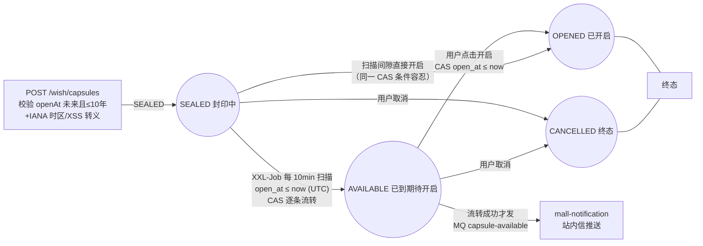

# 时间胶囊设计文档（Sprint 2.4：表⑦ time_capsule）

> 模块：mall-wish / mall-job / mall-notification / mall-admin · 交付日期：2026-08-23
> 需求依据：心愿宇宙文档 二-8 时间胶囊系统 / 2.7 API / 9.2 到期扫描 / 26.3 跨时区语义
> 范围：后端胶囊 CRUD + 到期扫描 + 通知推送 + 时区上报 + 管理统计；
> 四端前端页面属 s24-6~s24-9，本文档只定义后端契约与状态机。

---

## 1. 状态机与触发链路



- 到期判定唯一依据 UTC `open_at`；`open_at_timezone` 仅记录创建时用户
  IANA 时区供回溯展示/审计，不参与判定（文档 26.3：用户跨时区旅行不影响到期）
- SEALED + 已到期也可直接开启（CAS 条件含 SEALED）：容忍扫描间隙与时钟偏移，
  用户无需等待下一轮扫描

## 2. 跨时区语义（26.3 验收）

| 场景 | 行为 |
|---|---|
| UTC-12 创建 open_at=2026-01-01 00:00（本地，即 UTC 12:00） | 服务端只比较 UTC，与创建位置无关 |
| 用户旅行到 UTC+14 后胶囊到期 | 到期时刻不变（UTC 判定），不提前/延后 |
| 时区上报 `/my/timezone` | 写 `wish_user_stat.timezone`（IANA），重复上报幂等；仅用于通知发送时段优化，不改动胶囊判定 |
| 创建时 openAtTz | 格式校验（`ZoneId.of`）后落库，回显"创建于你的 xx 时区"用 |

## 3. 幂等与并发（全部 CAS 单条 UPDATE，无长事务）

| 场景 | 机制 |
|---|---|
| 并发双开 | `UPDATE ... SET status=OPENED, opened_at=now WHERE id=? AND status IN (SEALED,AVAILABLE) AND open_at<=now`，仅一方 affected=1；败方重查返回已开启内容 |
| 重复开启 | 入口先查状态，OPENED 直接返回内容（幂等） |
| 取消后再开启 | CANCELLED 是终态，开启抛 `WISH_CAPSULE_NOT_AVAILABLE` |
| 已开启后取消 | 抛 `WISH_STATUS_CONFLICT`（内容已见，取消无意义） |
| 同一胶囊扫描 2 次 | SEALED→AVAILABLE CAS 仅首次 affected=1，**仅成功方发 MQ 通知** → 天然去重 |
| 扫描期间用户新开启 | 双方各持 CAS 条件（status=SEALED），互斥，不丢事件不重复 |

## 4. 到期扫描链路（9.2）

```
XXL-Job capsuleOpenScanHandler（Cron 0 0/10 * * * ?）
  → POST http://mall-wish/internal/jobs/capsule-open-scan（X-Internal-Call 认证）
  → CapsuleServiceImpl.scanAvailableCapsules()
      分批 500 条/批循环至取尽（10000 条 < 30s 验收）
      逐条 CAS 独立提交（无外层事务）：
        affected=1 → CapsuleEventProducer.syncSend(wish-events:capsule-available)
        affected=0 → 并发已被处理，跳过
  → mall-notification WishEventConsumer（consumerGroup cg_notification_wish_event）
      站内信 type=CAPSULE_AVAILABLE，resourceType=CAPSULE
```

- MQ 发送在行级 CAS 提交后执行，避免"事务回滚但通知已外发"
- 发送失败 **Fail-Open**（记 ERROR 日志不阻断扫描）：推送缺口可由管理端
  通知推送记录核对补发（文档允许降级）
- 消费端假设消息可能重复（at-least-once）：通知展示型副作用，重复可容忍；
  后续接入独立通知渠道时需按 capsuleId 幂等去重

## 5. 接口契约（CapsuleController /capsules）

| 接口 | 方法 | 错误码 | 说明 |
|---|---|---|---|
| `/wish/capsules` | POST | 400 `WISH_OPEN_AT_PAST`（过去）/ 400 `WISH_VALIDATION_ERROR`（>10 年、非法时区、路径穿越） | 创建，SEALED；标题/内容 XSS 转义入库 |
| `/wish/capsules` | GET | 400 `WISH_VALIDATION_ERROR`（非法 status/cursor） | 我的列表：id 倒序游标分页（默认 20，上限 50），status 过滤 |
| `/wish/capsules/{id}` | GET | 404 `WISH_NOT_FOUND`（非本人/不存在，防探测） | 详情；非 OPENED 恒不返回 content/mediaUrls |
| `/wish/capsules/{id}/open` | POST | 409 `WISH_CAPSULE_NOT_AVAILABLE`（未到期/已取消） | 到期开启，幂等 |
| `/wish/capsules/{id}` | DELETE | 409 `WISH_STATUS_CONFLICT`（已开启） | 取消，终态 |
| `/wish/my/timezone` | PUT | 400 `WISH_VALIDATION_ERROR`（非法 IANA） | 时区上报，幂等；统计行缺失自动 `initUserStat`（`@Transactional` 包裹，满足其 MANDATORY 传播） |

安全契约：**非 OPENED 状态 `content`/`mediaUrls` 恒为 null**（SEALED/AVAILABLE/CANCELLED 一视同仁，防绕过——到期未开启同样隐藏，"开启"是唯一拆信路径）。

## 6. 管理端（mall-admin 代理）

| 接口 | 权限 | 链路 |
|---|---|---|
| `GET /admin/wish/capsules/stats` | `business:capsule:stats` | AdminCapsuleController → CapsuleFeignClient → mall-wish：total/sealed/available/opened/cancelled/todayCreated |
| `GET /admin/wish/capsules/notifications` | `business:capsule:stats` | → NotificationQueryFeignClient → mall-notification 通知列表（按 userId/type 过滤） |

Feign 携带 `X-Internal-Call: true`（AdminFeignInterceptor），mall-wish 侧
InternalJobController/管理接口仅信任该头。

## 7. 数据变更（Flyway V12）

表⑦ `time_capsule`：雪花主键、`idx_capsule_user(user_id,id)`（我的列表游标分页）、
`idx_capsule_open(open_at,status)`（到期扫描命中）、`open_at_timezone` 默认
Asia/Shanghai、status ENUM 四态。无软删（CANCELLED 即业务删除，文档 13.4 按生命周期决策）。

## 8. 降级与失败策略

| 依赖 | 策略 |
|---|---|
| RocketMQ 发送失败 | Fail-Open（ERROR 日志，扫描继续；推送缺口管理端可核对） |
| 通知服务不可用 | MQ 堆积重试，胶囊流转不受影响（已解耦） |
| 扫描接口被重复触发 | CAS 幂等，无重复推送 |
| 时区上报统计行缺失 | 同事务 init + 重试落库 |

## 9. 测试覆盖映射（验收清单 ↔ 用例）

| 验收项 | 用例 |
|---|---|
| 创建校验（过去时间/10 年/时区/防绕过） | CapsuleServiceImplTest.createCapsule*（5） |
| 列表分开展示/游标 | CapsuleServiceImplTest.listMyCapsules* + IT.capsuleList_cursorPagination |
| 详情未到期"封印中" | IT.capsuleLifecycle（content=null）+ UT.getDetail_sealed_contentHidden |
| 到期开启/并发双开/重复开启 | UT.openCapsule*（5）+ IT.capsuleLifecycle |
| 取消终态/已开启不可取消 | UT.cancelCapsule* + IT.capsuleCancel_terminalAndIrreversible |
| 定时扫描幂等（扫 2 次推 1 次） | IT.capsuleScan_transitionsAndPublishesOnce（verify MQ times(2) 二次扫描不增） |
| 跨时区 UTC 判定 | IT.capsuleOpen_sealedExpiredWithoutScan（不经扫描直接开启） |
| 时区上报幂等 | UT.reportTimezone* + IT.timezoneReport_persisted |
| 归属隔离（非本人 404） | UT.getDetail_notOwnerOrMissing + IT.capsuleOwnership_isolated |
| 扫描 500/批循环 | UT.scan_fullBatchLoops（500 条满批再查一轮） |
| 管理统计 | UT.adminStats_containsAllKeys + IT.adminStats_countsByStatus |

单测 25（PASS）/ 集成 8（PASS，真实 MySQL 9 + Redis 容器）。
集成测试另发现并修复：`reportTimezone` 调用 `initUserStat`（MANDATORY 事务）
缺外层事务 → 补 `@Transactional`。
