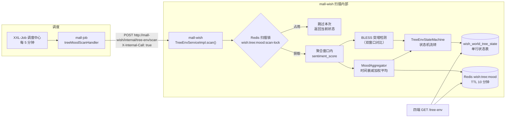
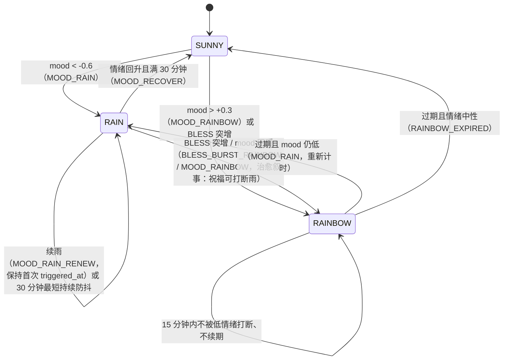

# 生命树情绪环境联动设计文档（Sprint 2.2 待办 ①）

> 模块：mall-wish / mall-job · 交付日期：2026-08-20
> 需求依据：心愿宇宙文档 2.2 节「气象情绪联动」+ Sprint 2.2 验收清单「情绪联动」项
> 范围边界：本交付仅含**情绪联动子系统**（RAIN/RAINBOW/SUNNY 三态）。
> 季节/天气 API/特殊事件/前端 3D 环境渲染属 Sprint 2.1/2.2 其余部分，表结构与
> 枚举已预留扩展空间（environment 为 VARCHAR，非 ENUM）。

---

## 1. 调用链路

## 2. 数据源决策（对文档 2.2 原文的偏差，已记录）

| 项 | 文档 2.2 原文 | 实际实现 | 理由 |
|---|---|---|---|
| 情感分析来源 | mall-job 每 5 分钟拉取窗口内 TREE_HOLE 心愿 `wish.description` 调 DashScope 文本情感分析 | 复用 Sprint 1.3 树洞 AI 回复已产出的 `wish_ai_conversation.sentiment_score`（仅 TREE_HOLE 场景 ASSISTANT 记录） | ① 零额外 AI 调用成本（免费额度 1000 次/天留给其他场景）；② 不重复外发用户文本，隐私链路更短；③ Sprint 1.3 已有存量数据，立即生效 |
| trigger_env_emo 过滤 | 仅 TREE_HOLE（该类型心愿创建时强制 trigger_env_emo=true） | 按 `scene=TREE_HOLE` 过滤，未逐心愿 join `trigger_env_emo` | TREE_HOLE 心愿创建时该字段强制 true（WishServiceImpl），管理端手动关闭属极端场景；session_id 字符串解析 join 脆弱，聚合分数为模糊语义无需精确排除 |

## 3. 聚合算法（MoodAggregator，纯函数）

- 数据源：`wish_ai_conversation WHERE scene='TREE_HOLE' AND role='ASSISTANT' AND sentiment_score IS NOT NULL AND created_at >= now - 窗口`
- 窗口：默认 60 分钟（`wish.tree-env.mood-window-minutes`，Nacos 可调）
- 权重：`w = exp(-λ × 样本年龄分钟)`，λ 默认 0.0231（60 分钟前样本权重衰减至 25%），秒级精度
- 分数：`mood = Σ((score/100) × w) / Σw`，clamp 至 [-1.0, 1.0]
- 无样本 → mood=null（不触发任何环境变更）

## 4. 环境状态机（TreeEnvStateMachine，纯函数，优先级自上而下）

关键语义：
- **RAIN 最短持续**：首次触发后 30 分钟内即使情绪回升也不恢复晴天（防抖）；`triggered_at`
  续雨时保持首次值（不重置基准）
- **RAINBOW 固定时长**：15 分钟，激活期间不续期、不被打断；过期后条件仍满足则重新触发刷新时间窗
- **阈值边界**：按文档严格不等号（mood < -0.6 下雨 / mood > +0.3 彩虹，恰好等于阈值不触发）

### BLESS 突增口径（文档未定义，本交付定义且参数化）

当前 15 分钟窗口 BLESS 计数 ≥ 最小计数（默认 5）且 ≥ 前 15 分钟窗口计数 × 倍率（默认 2.0）。
前一窗口为 0 时满足最小计数即触发。参数均经 `wish.tree-env.*` Nacos 热更新。

## 5. 数据与缓存

### 5.1 wish_world_tree_state（V4 迁移，单行 id=1）

| 字段 | 说明 |
|---|---|
| environment | VARCHAR(32)：SUNNY/RAIN/RAINBOW，预留季节/天气/特殊事件扩展（配置表化要求不改表结构） |
| environment_source | 最近一次变更来源（INIT/MOOD_RAIN/MOOD_RAIN_RENEW/MOOD_RAINBOW/BLESS_BURST_RAINBOW/RAINBOW_EXPIRED/MOOD_RECOVER），观测用 |
| triggered_at | 当前环境触发时间；RAIN 续雨保持首次值 |
| expires_at | 过期时间；NULL=持续至扫描复评（RAIN 语义）。**写库用 UpdateWrapper 显式 set null**（updateById 跳过 null 会导致 RAINBOW→RAIN 旧值残留） |
| last_scan_at / sample_count | 扫描时间与聚合计数（仅计数，无情绪明细） |

### 5.2 Redis

| Key | 结构 | TTL | 失败策略 |
|---|---|---|---|
| `wish:tree:mood` | JSON `{score, computedAt, sampleCount}` | 10 分钟（文档 2.2 指定） | 写失败 WARN 后跳过（Fail-Open，下次扫描重写）；读失败返回 moodScore=null（环境状态以 DB 为准） |
| `wish:tree:mood:scan-lock` | SET NX EX 占位 | 240s | 获取失败跳过本次扫描（多实例互斥）；Redis 不可用时无锁继续（单行幂等写入可容忍） |

## 6. 隐私合规（文档 2.2）

- `current_mood_score` **不落库**，仅存 Redis 10 分钟（只保留聚合分数，不含单条文本情绪）
- `sample_count` 落库仅为聚合计数，无法反推个体情绪
- 不外发任何用户文本至第三方（与文档原文方案相比额外消除了重复外发链路）

## 7. 接口契约

| 接口 | 方法 | 权限 | 说明 |
|---|---|---|---|
| `/tree-env` | GET | 公开（未登录首页/世界树亦需渲染） | 返回 environment/source/triggeredAt/expiresAt/lastScanAt/moodScore(可空)/sampleCount |
| `/internal/tree-env/scan` | POST | ROLE_INTERNAL（X-Internal-Call: true） | mall-job 每 5 分钟触发；幂等 |

注意：mall-wish 的 InternalCallAuthenticationFilter 仅识别 `X-Internal-Call: true`，
与其他服务（"mall-job" 值）不同，handler 已按 true 发送（BusinessJobHandler 既有
handler 的取值差异为既有问题，未在本次范围内改动）。

## 8. 配置（wish.tree-env.*，Nacos 热更新）

| 键 | 默认 | 说明 |
|---|---|---|
| mood-window-minutes | 60 | 聚合滑动窗口 |
| mood-decay-lambda | 0.0231 | 时间衰减系数（60 分钟→25%） |
| rain-threshold | -0.6 | 下雨阈值（严格小于） |
| rainbow-threshold | 0.3 | 彩虹阈值（严格大于） |
| rain-min-duration-minutes | 30 | 下雨最短持续 |
| rainbow-duration-minutes | 15 | 彩虹持续 |
| bless-burst-window-minutes | 15 | BLESS 突增窗口 |
| bless-burst-min-count | 5 | BLESS 突增最小计数 |
| bless-burst-multiplier | 2.0 | BLESS 突增倍率 |
| mood-cache-ttl-minutes | 10 | mood 缓存 TTL |
| scan-lock-ttl-seconds | 240 | 扫描锁 TTL |

## 9. XXL-Job 任务登记

执行器：mall-job · JobHandler：`treeMoodScanHandler` · 建议 Cron：`0 */5 * * * ?`（每 5 分钟）
需在 XXL-Job 控制台手动登记任务（与既有 groupExpirationHandler 等同流程）。

## 10. 验证状态

| 项 | 结果 |
|---|---|
| 单元测试（MoodAggregator 8 + StateMachine 15 + ServiceImpl 9） | 32/32 PASS |
| 全模块单元回归（基线 178 + 新增 32） | 210/210 PASS |
| 集成测试 TreeEnvIntegrationTest（12 例：聚合过滤/RAIN 触发/RAINBOW 触发/BLESS 打断/防抖/恢复/过期回落/锁互斥/查询） | 12/12 PASS（2026-08-20 用户本机，含基线 23 例回归共 35/35） |
| Flyway V4 在远程 mysql-it 迁移 | PASS（随集成测试首次执行自动验证） |
